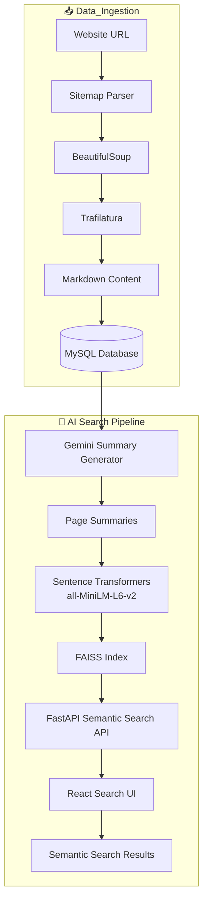

<div align="center">

# 🚀 AI-Powered Website Semantic Search Engine

### AI-powered semantic search engine built with FastAPI, React, FAISS, Sentence Transformers, MySQL, and Google Gemini.

An intelligent semantic search engine that crawls websites, extracts webpage content, stores it in MySQL, generates AI-powered summaries using Google Gemini, creates semantic embeddings with Sentence Transformers, indexes them using FAISS, and enables fast semantic retrieval through a FastAPI backend and React frontend.

<br>


</div>

## ✨ Features

- 🌐 Crawl an entire website using its sitemap.
- 📄 Extract webpage content automatically.
- 🧹 Convert raw HTML into clean Markdown.
- 💾 Store processed pages in MySQL.
- 🤖 Generate AI-powered summaries using Google Gemini.
- ⚡ Parallel summary generation for faster processing.
- 🧠 Generate semantic embeddings using all-MiniLM-L6-v2.
- 🔍 Fast semantic retrieval using FAISS.
- 🎯 Result reranking and keyword highlighting.
- 🌍 REST APIs built with FastAPI.
- 💻 Interactive search interface built with React.

# 🔄 Complete Project Workflow

```
Website URL
      │
      ▼
Read sitemap.xml
      │
      ▼
Extract all page URLs
      │
      ▼
Download HTML of every page
      │
      ▼
Parse HTML using BeautifulSoup
      │
      ▼
Convert HTML → Markdown
      │
      ▼
Store in MySQL (Page_Scrapped)
      │
      ▼
Generate summaries using Gemini
      │
      ▼
Store summaries in MySQL (Page_Summary)
      │
      ▼
Generate embeddings using all-MiniLM-L6-v2
      │
      ▼
Build FAISS Index
      │
      ▼
FastAPI Semantic Search API
      │
      ▼
React Search UI
```

## 🏗️ System Architecture



# ⚙️ Technology Stack

|      Category       |      Technology    |
|---------------------|--------------------|
|      Language       |       Python       |
|      Backend        |       FastAPI      |
|      Frontend       |        React       |
|      Database       |        MySQL       |
|      AI Model       |    Google Gemini   |
|   Embedding Model   |   all-MiniLM-L6-v2 |
|   Vector Database   |        FAISS       |
|     HTML Parsing    |    BeautifulSoup   |
| Markdown Extraction |     Trafilatura    |
|      API Testing    |       Postman      |

# 📈 Development Journey

## Phase 1: Website Crawling & Content Storage

1. User provides a website URL.
2. The sitemap (`sitemap.xml`) is parsed using BeautifulSoup.
3. All webpage URLs are extracted.
4. HTML content is downloaded.
5. Trafilatura converts HTML into clean Markdown.
6. The Markdown content is stored in the `Page_Scrapped` column of MySQL.

## Phase 2: AI Summary Generation

1. Stored webpage content is fetched from MySQL.
2. Google Gemini generates concise page summaries.
3. Summaries are stored back in the database.

## Phase 3: Semantic Search Indexing

1. Sentence Transformers (`all-MiniLM-L6-v2`) generate embeddings from the summaries.
2. Embeddings are indexed using FAISS.
3. Metadata is linked with every embedding.

## Phase 4: Semantic Search

1. User enters a search query.
2. The query is converted into an embedding.
3. FAISS retrieves the most relevant pages.
4. Results are reranked.
5. Keywords are highlighted.
6. Matching pages are displayed through the React interface.

- # 📂 Project Structure

```text
WebsiteScraper/
│
├── embeddings/
├── frontend/
├── app.py
├── config.py
├── database.py
├── scraper.py
├── merged.py
├── summary_generator.py
├── generate_summaries.py
├── build_index.py
├── models.py
├── logger.py
├── requirements.txt
└── README.md
```

# 🚀 Installation

git clone <repository-url>

cd website-semantic-search

pip install -r requirements.txt

uvicorn app:app --reload

## Configure Environment Variables

Create a `.env` file:
Gemini_API_Key=YOUR_API_KEY

# 📡 API Endpoints

|  Method  |       Endpoint      |           Description         |
|----------|---------------------|-------------------------------|
|   POST   |       `/scrape`     | Crawl website and store pages |
|    GET   |     `/sitemaps`     |      Get stored sitemaps      |
|    GET   |     `/urls/{id}`    |          List URLs            | 
|   POST   |  `/semantic-search` |    Perform semantic search    |
|    GET   |      `/suggest`     |        Search suggestions     |

