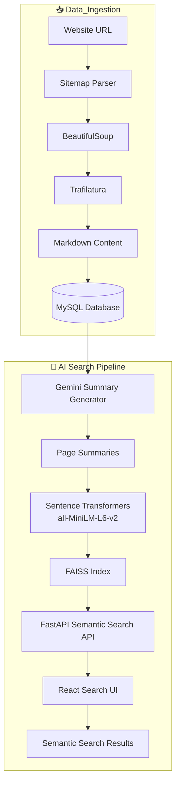

# 🚀 AI-Powered Website Semantic Search Engine

An intelligent semantic search engine that crawls websites, extracts webpage content, stores it in MySQL, generates AI-powered summaries using Google Gemini, builds semantic embeddings with Sentence Transformers, indexes them using FAISS, and provides fast semantic search through a FastAPI backend and React frontend.

## ✨ Features

- 🌐 Crawl an entire website using its sitemap.
- 📄 Extract webpage content automatically.
- 🧹 Convert raw HTML into clean Markdown.
- 💾 Store processed pages in MySQL.
- 🤖 Generate AI-powered summaries using Google Gemini.
- ⚡ Parallel summary generation for faster processing.
- 🧠 Generate semantic embeddings using all-MiniLM-L6-v2.
- 🔍 Fast semantic retrieval using FAISS.
- 🎯 Result reranking and keyword highlighting.
- 🌍 REST APIs built with FastAPI.
- 💻 Interactive search interface built with React.

# 🔄 Complete Project Workflow

```
Website URL
      │
      ▼
Read sitemap.xml
      │
      ▼
Extract all page URLs
      │
      ▼
Download HTML of every page
      │
      ▼
Parse HTML using BeautifulSoup
      │
      ▼
Convert HTML → Markdown
      │
      ▼
Store in MySQL (Page_Scrapped)
      │
      ▼
Generate summaries using Gemini
      │
      ▼
Store summaries in MySQL (Page_Summary)
      │
      ▼
Generate embeddings using all-MiniLM-L6-v2
      │
      ▼
Build FAISS Index
      │
      ▼
FastAPI Semantic Search API
      │
      ▼
React Search UI
```

## 🏗️ System Architecture



# ⚙️ Technology Stack

|      Category       |      Technology    |
|---------------------|--------------------|
|      Language       |       Python       |
|      Backend        |       FastAPI      |
|      Frontend       |        React       |
|      Database       |        MySQL       |
|      AI Model       |    Google Gemini   |
|   Embedding Model   |   all-MiniLM-L6-v2 |
|   Vector Database   |        FAISS       |
|     HTML Parsing    |    BeautifulSoup   |
| Markdown Extraction |     Trafilatura    |
|      API Testing    |       Postman      |

# 📈 Development Journey

### Phase 1 – Website Crawling

- Read sitemap.xml
- Extract URLs
- Download HTML pages
- Parse HTML
- Convert HTML to Markdown
- Store content in MySQL

### Phase 2 – Backend API

- Converted CLI pipeline into FastAPI
- Exposed REST APIs
- Tested APIs using Postman

### Phase 3 – Code Refactoring

- Modularized project
- Improved maintainability
- No change in functionality

### Phase 4 – Semantic Search

- Generated embeddings
- Built FAISS index
- Implemented semantic retrieval
- Added reranking
- Added keyword highlighting

### Phase 5 – AI Summarization

- Integrated Google Gemini
- Generated summaries
- Stored summaries in MySQL
- Parallelized API calls
- Switched embeddings from webpage content to summaries

- # 📂 Project Structure

```text
WebsiteScraper/
│
├── embeddings/
├── frontend/
├── app.py
├── config.py
├── database.py
├── scraper.py
├── merged.py
├── summary_generator.py
├── generate_summaries.py
├── build_index.py
├── models.py
├── logger.py
├── requirements.txt
└── README.md
```

# 🚀 Installation

git clone <repository-url>

cd website-semantic-search

pip install -r requirements.txt

uvicorn app:app --reload

## Configure Environment Variables

Create a `.env` file:
Gemini_API_Key=YOUR_API_KEY

# 📡 API Endpoints

|  Method  |       Endpoint      |           Description         |
|----------|---------------------|-------------------------------|
|   POST   |       `/scrape`     | Crawl website and store pages |
|    GET   |     `/sitemaps`     |      Get stored sitemaps      |
|    GET   |     `/urls/{id}`    |          List URLs            | 
|   POST   |  `/semantic-search` |    Perform semantic search    |
|    GET   |      `/suggest`     |        Search suggestions     |

